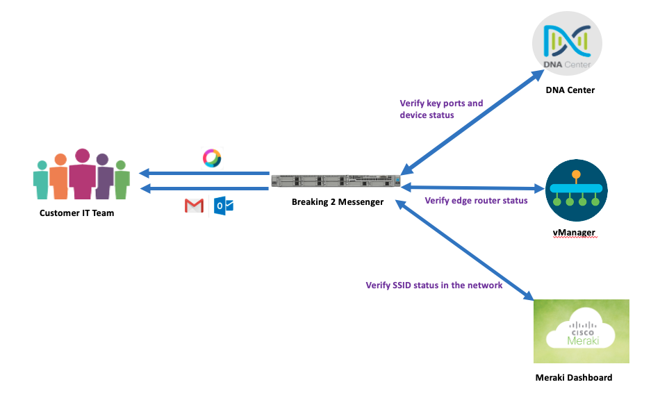

# Breaking2 Messager

Breaing 2 Messager Solution:

Cisco DNA(switch, AP, router, DNA Center) + Cisco Meraki(AP) + Cisco SDWAN(vBond, vSmart, vManager and edges) = Breaking 2 Messager solution

## Requirements
- Cisco DNA Center 1.3.3
- Cisco SD-WAN (Viptela)
- Cisco Meraki
- Cisco Webex Teams
- Public e-mail mailbox

## Description

This project is a real customer requirement when we demo DNAC solution to customer. 

Currently on Cisco EN solution side, including SD-WAN/DNA/Meraki, customer must monitor the dashboard all the time. No one knows which device is detached or disabled or rebooted or other problems in the next minutes.

Customer requirement is that cisco solution need notify IT in 1 minutes when one key device is removed from network. 

## How it works

From the DNAC, Breaking 2 messager will monitor these key devices all the time.
When it is removed or disappears, IT can be notified right now to check what happens, and fix it as soon as possible.
Customer does not share which device is, Obviously, it may be a key asset, or a shared key device.

Moreover DNAC, we add the notification system to Meraki, SD-WAN too.

Breaking 2 messager is a common notification system, not only for DNA, SD-WAN, Meraki, but also for ACI, FMC and so on.

## Demo Topology

Note that breaking 2 messager support multiple solutions in this design, so IT can be notified when any solution has problems, and it is easy to add more functons to check other status.



## Install

Install Python Backend:
```bash
git clone https://github.com/Breaking2Messager/Breaking2.git
cd Breaking2
pip install -r requirements.txt
python3 Breaking2Messager.py
```

## Environment Variable
Breaking 2 messager need two environment variable: env_device.py and env_user_credentials.py

content for env_device.py
```python
vManager_HOST = "sandboxsdwan.cisco.com"
DNAC_HOST = "sandboxdnac.cisco.com"
MERAKI_URL = "https://api.meraki.com/api/v0/"
MERAKI_NETWORK_ID = "L_566327653141843049"
WEBEX_TEAMS_URL = "https://api.ciscospark.com/v1/messages"
EMAIL_HOST = "smtp.163.com"
EMAIL_SEND_MAILBOX = "your_email@163.com"
EMAIL_RECV_MAILBOX = ["notify_recv_1@cisco.com", "notify_recv_2@cisco.com"]
```

Content for env_user_credentials.py
```python
vManager_USERNAME = "vmanager_username"
vManager_PASSWORD = "vmanager_password"
DNAC_USER = "dnac_username"
DNAC_PASSWORD = "dnac_password"
MERAKI_API_KEY = "meraki_api_key"
EMAIL_USERNAME = "email_username"
EMAIL_PASSWORD = "email_password"
WEBEX_TEAMS_SPACE = "webex_team_space_more_than_70_characters"
WEBEX_TEAMS_TOKEN = "webex_teams_token_more_than_100_characters"
```
